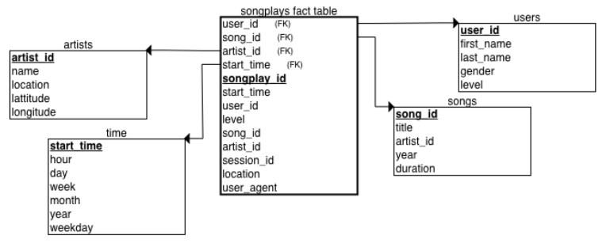

Project 5: Data Pipelines with Airflow
======================================

Udacity Data Engineer Nanodegree project
----------------------------------------

### Issue to solve in the project

An imagined music streaming company, Sparkify, has decided that it is time to introduce more automation and monitoring to their data warehouse ETL pipelines and come to the conclusion that the best tool to achieve this is Apache Airflow.

They have decided to create high grade data pipelines that are dynamic and built from reusable tasks, can be monitored, and allow easy backfills. They have also noted that the data quality plays a big part when analyses are executed on top the data warehouse and want to run tests against their datasets after the ETL steps have been executed to catch any discrepancies in the datasets.

The source data resides in S3 and needs to be processed in Sparkify's data warehouse in Amazon Redshift. The source datasets consist of JSON logs that tell about user activity in the application and JSON metadata about the songs the users listen to.

### Schema design

The star schema has 1 fact table (songplays), and 4 dimension tables (artists, songs,  time, users).

### Data sources

Data sources are provided by two public S3 buckets:

`Song data: s3://udacity-dend/song_data`

`Log data: s3://udacity-dend/log_data`

Song data bucket contains info about songs and artists. Log data bucket has info concerning actions done 
by users (f.ex. which song they are listening). The objects contained in both buckets are JSON files. 

### Files

`udac_example_dag.py` : tasks and dependencies of the DAG. It should be placed in the `dags` directory of your Airflow installation

`create_tables.sql` : SQL queries used to create all the required tables in Redshift. It should be placed in the main directory of your Airflow installation

`sql_queries.py` : SQL queries used in the ETL process. It should be placed in the `plugins/helpers` directory of your Airflow installation

operators:

`stage_redshift.py` : StageToRedshiftOperator, copies JSON data from S3 to staging tables in the Redshift data warehouse

`load_dimension.py` : LoadDimensionOperator, loads a dimension table from data in the staging table(s)

`load_fact.py` : LoadFactOperator, loads a fact table from data in the staging table(s)

`data_quality.py` : DataQualityOperator, runs a data quality check by passing an SQL query and expected result as arguments, failing if the results don't match

above operators should be placed in the `plugins/operators` directory of Airflow installation!

